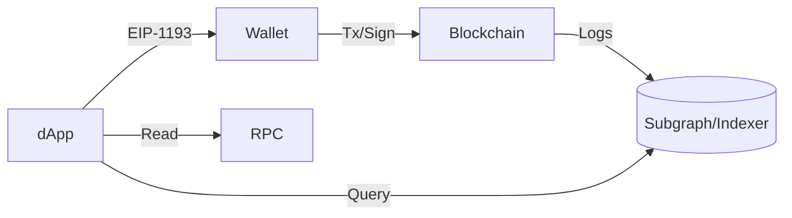

“Web3”不是一个单一产品，而是一组互相强化的理念与技术集合：密码学身份、开放协议、可组合金融/内容组件、链上可验证状态，以及逐步去平台化的组织与治理方式。本文从历史演进到工程落地，系统阐述 Web3 的核心特点、挑战与最佳实践，并给出可操作的架构与工具清单。

## 1. 从 Web1 → Web2 → Web3：范式迁移
- Web1（只读）：门户/个人主页，内容由站点生产，用户是“浏览者”；
- Web2（读写）：用户生成内容（UGC）+ 平台算法分发，账号与数据由平台托管；
- Web3（读写+拥有）：私钥拥有权与可验证规则，资产/身份与应用松耦合（可携带、可组合）。

迁移的本质：从“中心化平台对数据与身份的控制”转向“用户用私钥控制身份与资产”，从“平台背书可信”转向“协议与加密保证可信”。

## 2. Web3 的核心特征（工程视角）
1) **去中心化身份（DID）**：地址/公钥或 DID 文档作为标识，签名即授权；
2) **合约化规则**：规则公开、可验证、可复用，透明度优先；
3) **可组合性（Money Legos）**：协议接口标准化（ERC/EIP），上层快速组合创新；
4) **开放互操作**：跨链桥、消息传递与共享标准；
5) **可验证与可追溯**：状态在链上可校验、事件可重放，抗审查能力更强；
6) **经济激励**：代币与治理机制协调参与者行为。

## 3. 用户体验的现实挑战
- 私钥与助记词管理门槛高；
- Gas 与网络切换等概念复杂；
- 交易确认有延迟与不确定性；
- 欺诈与钓鱼风险（签名诱导、授权过大）。

工程应对：账户抽象（代付/批量）、清晰签名提示（EIP-4361）、自动网络配置（EIP-3085/3326）、可回滚的 UI 设计。

## 4. 参考架构

- 前端：与钱包交互、展示状态、触发交易；
- 合约：资产/规则中心；
- 索引器：对事件进行结构化，支撑列表/统计；
- RPC：直接读取链上视图状态。

## 5. 身份与资产：DID、VC 与 Token
- DID（去中心化身份）：基于公私钥/文档解析；
- VC（可验证凭证）：证明所有权/资格；
- Token：Fungible（ERC-20）与 Non-Fungible（ERC-721/1155）；
- 授权：Permit（EIP-2612）减少批准交易；
- 治理：一币一票/权重委托。

## 6. 互操作与扩容：L2 与跨链
- Layer2（Rollup/Validium）提高吞吐并降低成本；
- 跨链桥风险管理：信任模型、消息证明与流动性桥；
- 数据可用性层（DA）：Celestia/以太坊 DA 提供可验证数据发布。

## 7. 风险与监管
- 合约漏洞：重入、访问控制、数学错误；
- 经济攻击：预言机操纵、MEV；
- 法务合规：KYC/AML、证券属性判断；
- 隐私：链上透明与用户隐私的平衡（ZK/混币等）。

## 8. 工具与生态清单
- 前端：viem、wagmi、ethers.js；
- 合约：Solidity、Foundry/Hardhat、OpenZeppelin；
- 索引器：The Graph、SubQuery、自建 ETL（ClickHouse/PostgreSQL）；
- 基础设施：Infura/Alchemy、自建 Erigon/Geth；
- 监控：Tenderly、Etherscan API、Prometheus/Grafana；
- 测试：本地链（anvil/hardhat），fork 主网验收。

## 9. 经典案例剖析（简述）
- DeFi 协议（Aave/Uniswap）：开放可组合与 LP 激励、风险参数治理；
- NFT 市场：元数据与版税策略、跨市场可转移性；
- DAO：资金透明、投票执行自动化。

## 10. 最佳实践（工程落地）
- 信任最小化：后端仅做聚合/缓存；
- 可观测：交易/事件/索引延迟全链路指标；
- 文档化：签名提示清晰、错误码与引导页；
- 灰度发布：多网络/小流量上线；
- 安全上线流程：审计+Bug Bounty+多签开关。

## 11. 小结
Web3 的“拥有权”愿景并不与“良好体验”矛盾，关键在于以工程方法补齐体验鸿沟：钱包与账户抽象降低门槛、索引器与缓存支撑用户级响应、跨链与 L2 提供可用性。坚持“开放、互操作、可组合”的原则，才可能在复杂生态中保持长期生命力。
