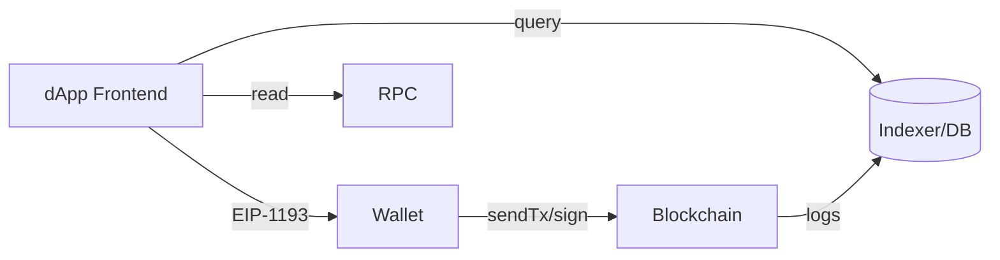

在 Web3 语境下，“应用”与传统 Web2 的差异并不只是是否使用区块链，而是信任模型从“平台背书”转向“代码即法律（Code is Law）”与“加密签名即授权”。DApp 的工程化落地，归根结底是围绕三件事：身份与授权（钱包）、状态与规则（智能合约）、读写与观测（RPC/索引器）。本文从体系结构到实战细节，带你搭建一个可上线的 DApp，并覆盖常见错误与运维要点。

## 1. 架构概览与信任边界
- 前端（dApp）：运行在用户浏览器或移动端，负责连接钱包、发起签名、调用合约、渲染数据；
- 钱包（Provider/Signer）：保存私钥，EIP-1193 暴露统一接口，EVM 链上用 `eth_*` JSON-RPC；
- 合约（EVM Solidity）：在链上保存规则与资产，事件（logs）作为“事实来源”；
- 后端/索引器：尽量“最小信任”。使用 The Graph/SubQuery/自建 ETL，将事件抽取到可查询存储以供前端检索；
- 节点与网关：Infura/Alchemy/自建 Geth/Erigon；选择稳定 RPC 与指数退避策略；
- 可观测与告警：交易成功率、确认时间、事件延迟、钱包连接失败率、RPC 错误码分布。



## 2. 钱包连接与权限模型（EIP-1193/6963）
EIP-1193 统一了 Provider 的交互方式，EIP-6963 定义多钱包发现与选择机制。常见流程：
1) 发现与连接钱包（请求账户权限）；2) 检查与切换网络；3) 监听账户/网络变化；4) 以签名/交易完成授权。

```js
// 探测 Provider（EIP-1193），兼容多钱包
import { ethers } from 'ethers'
const anyProvider = window.ethereum
if (!anyProvider) throw new Error('No wallet provider found')
// 请求账户权限（用户会看到弹窗）
await anyProvider.request({ method: 'eth_requestAccounts' })
const provider = new ethers.BrowserProvider(anyProvider)
const signer = await provider.getSigner()
console.log('address=', await signer.getAddress())
// 监听账户/网络变化
anyProvider.on('accountsChanged', (accs)=>{ /* 刷新会话 */ })
anyProvider.on('chainChanged', (chainId)=>{ window.location.reload() })
```

网络切换（EIP-3085/3326）：
```js
// 若链ID不匹配，引导用户添加并切换
await anyProvider.request({
  method: 'wallet_addEthereumChain',
  params: [{ chainId: '0x1', chainName: 'Ethereum', rpcUrls: ['https://mainnet.infura.io/v3/xxx'], nativeCurrency: {name:'ETH',symbol:'ETH',decimals:18}}]
})
```

## 3. 合约设计与最小可行用例（Solidity）
以“白名单凭证 NFT”举例：
- 功能：允许白名单地址铸造一次；
- 事件：`Minted(address indexed to, uint256 tokenId)`；
- 安全：只读视图函数 `whitelisted(address)`；
- 运维：合约版本标识与所有者（多签）。

```solidity
// SPDX-License-Identifier: MIT
pragma solidity ^0.8.20;
import {ERC721} from "solmate/tokens/ERC721.sol";
import {Owned} from "solmate/auth/Owned.sol";

contract Voucher is ERC721, Owned {
    mapping(address => bool) public used;
    uint256 public nextId;
    string public baseURI;

    event Minted(address indexed to, uint256 indexed tokenId);

    constructor(string memory _name, string memory _symbol, string memory _base) ERC721(_name,_symbol) Owned(msg.sender) {
        baseURI = _base;
    }

    function tokenURI(uint256 id) public view override returns (string memory) {
        return string(abi.encodePacked(baseURI, _toString(id), ".json"));
    }

    function mint() external {
        require(!used[msg.sender], "used");
        used[msg.sender] = true;
        uint256 id = ++nextId;
        _safeMint(msg.sender, id);
        emit Minted(msg.sender, id);
    }
}
```

部署（Foundry）：
```bash
forge create --rpc-url $RPC --private-key $PK src/Voucher.sol:Voucher \
  --constructor-args "Voucher" "VCH" "ipfs://CID/"
```

## 4. 前端读写分层与索引器
- 写：调用 `mint()` 发起交易。需要 Nonce 管理（失败重发）、Gas 估算冗余（+10~20%）、提示用户确认。
- 读：合约状态（`used(addr)`、`ownerOf`）适合实时 RPC；批量列表（最近铸造）用索引器重放事件。

```js
// 写：mint
const voucher = new ethers.Contract(addr, abi, signer)
const tx = await voucher.mint()
const receipt = await tx.wait() // 等待确认，前端显示 Pending/Confirmed

// 读：单点查询
const used = await voucher.used(address)

// 读：通过 subgraph/自建 indexer，
// 例如请求 /api/minted?owner=0xabc 返回分页列表
```

索引器方案：
- The Graph：声明式子图，快；
- 自建 ETL：使用 `ethers` 订阅事件写入 PostgreSQL/ClickHouse，配合 REST/GraphQL 查询；
- 延迟与一致性：UI 上标注“最新区块高度”，避免用户对数据新鲜度的误解。

## 5. 错误处理与用户体验
- 交易被用户拒绝：错误码 `4001` → 友好提示；
- Nonce 过低/冲突：后端给出“替换交易”指导；
- Gas 估算失败：提供“手动输入”模式，并提示风险；
- 网络切换失败：指导手动添加 RPC，或降级到只读模式；
- 交易 Pending 过久：给出区块浏览器链接；
- 本地缓存：用 IndexedDB 缓存用户最近交互状态，提升体验。

## 6. 安全清单
- 签名提示（EIP-4361 SIWE）明确用途，避免“盲签”；
- 前端不要保存私钥；
- 合约函数最小暴露，使用 `reentrancy guard` 与访问控制；
- 升级与多签：关键参数由多签修改，预留“暂停开关”；
- 依赖锁定：固定依赖版本，审计后再升级；
- 漏洞响应：准备紧急流程与白帽通道。

## 7. 部署与运维
- 环境：Testnet（Sepolia/holesky）→ Mainnet/L2；
- RPC：多供应商容灾（Infura/Alchemy/自建），退避+重试；
- 日志：合约事件/前端错误/链上回执三方对账；
- 指标：交易成功率、确认时间分布、钱包连接失败率、索引器延迟；
- 版本回滚：前端通过 CDN 回滚，合约通过“开关+迁移”方案；
- 风险演练：限流/拥塞/价格飙升场景压测。

## 8. 典型问题与排查
- 交易总失败：检查链 ID、不足 Gas、Nonce 冲突、RPC 限流；
- 事件读取不全：索引器区块范围/重组处理、分片并行拉取；
- 钱包不兼容：提供 WalletConnect 与多 Provider 适配；
- L2 差异：确认时间、手续费代币与跨链桥时延。

## 9. 进阶：多链与账户抽象（AA）
- 多链：统一接口层（如 wagmi/viem），在 UI 与配置层做网络切换；
- 账户抽象（EIP-4337）：用 `UserOperation` 替代直接 `sendTransaction`，可实现“代付手续费”“批量操作”等体验优化。

## 10. 小结
一个可上线的 DApp，不只是一两个合约与一个页面，需要“端-链-索引-观测”的闭环设计。以钱包为入口、合约为规则源，辅以稳健的读写分层与索引器，是工程落地的通用路径。持续优化签名提示、错误处理与运维指标，才能支撑从爱好者到大众用户的跃迁。
