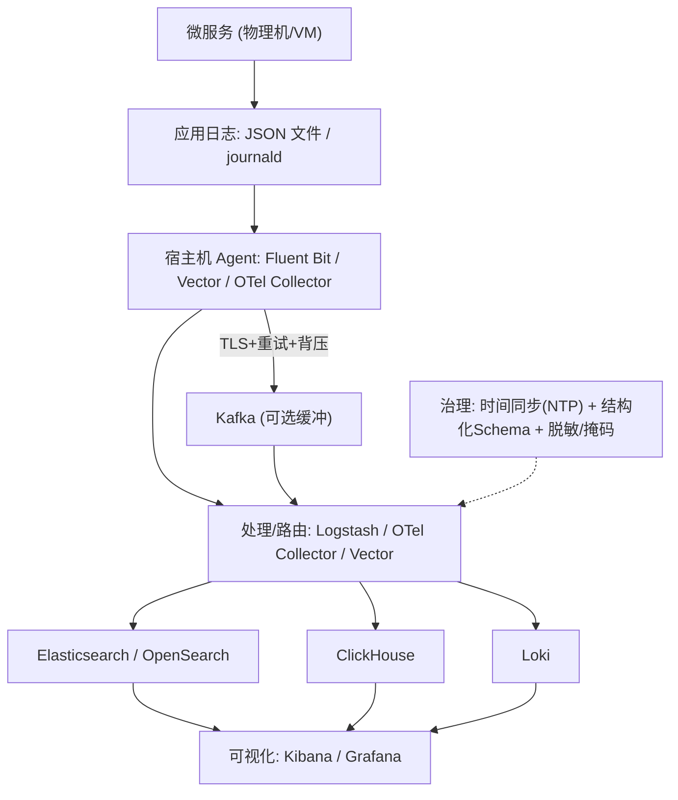
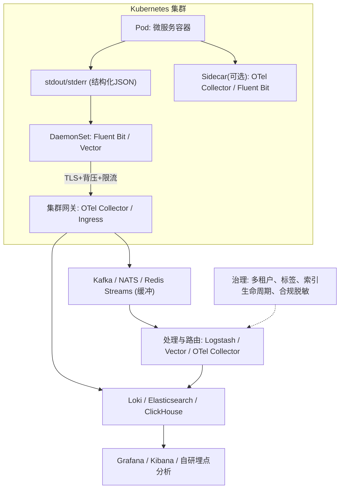

如何在 PHP 体系下实现实时日志采集、清洗、聚合与检索？本文结合物理机与 Kubernetes 两种运行环境，给出分阶段演进路线、最佳实践与可落地配置（EFK/PLG/ClickHouse/OTel），并附带 PHP 端具体实现建议。

## 架构概览
### 物理机 / VM 拓扑


### Kubernetes 拓扑


## 演进阶段与适用场景
- 传统本地文件 + logrotate：单机/少量服务；简单但难检索、风险高。
- 中央化 Syslog（rsyslog/syslog-ng/journald）：轻量汇聚，结构化不足。
- EFK/ELK：强检索与可视化；成本与治理压力需控制（ILM）。
- 容器化（stdout JSON + DaemonSet Agent）：与 K8s 契合；注意 label 基数。
- 事件流驱动（Kafka/NATS 缓冲解耦）：高吞吐可重放；链路更长。
- OpenTelemetry 一体化：标准 OTLP，日志/链路/指标互相关联。
- 成本/性能优化（Loki/ClickHouse/对象存储分层）：性价比高，查询语义差异需适配。

## 通用最佳实践
- 结构化与上下文：统一 JSON Schema（timestamp、level、service、env、trace_id、span_id、request_id、user_id）。
- 安全合规：采集端脱敏/掩码；TLS 传输；RBAC；多租户隔离。
- 稳定性：本地缓冲、断点续传、退避重试、背压/限流、时钟同步。
- 成本与性能：控制日志级别与采样；热/温/冷分层；限制高基数字段。
- 运维治理：ILM/TTL；集中配置与热更新；SLO/告警（延迟、拒收、落库错误率）。

## 物理机/VM 最佳实践
推荐：应用输出 JSON 到文件或 journald；宿主机 Agent（Fluent Bit/Vector/OTel Collector）采集→可选 Kafka 缓冲→后端（OpenSearch/ClickHouse/Loki）。

### Fluent Bit（Tail → Kafka → OpenSearch）
```ini
[SERVICE]
    Flush        1
    Parsers_File parsers.conf
    Log_Level    info

[INPUT]
    Name              tail
    Path              /var/log/app/*.log
    Tag               app.*
    Multiline         On
    Parser            docker
    DB                /var/lib/fluent-bit/tail.db
    Mem_Buf_Limit     50MB
    Skip_Long_Lines   On

[FILTER]
    Name          modify
    Match         app.*
    Add           env prod
    Add           service myservice

[OUTPUT]
    Name            kafka
    Match           app.*
    Brokers         kafka-1:9092,kafka-2:9092
    Topics          logs.app
    rdkafka.queue.buffering.max.ms 100
    rdkafka.compression.codec      lz4
    rdkafka.security.protocol      ssl

[OUTPUT]
    Name            es
    Match           app.*
    Host            opensearch.local
    Port            9200
    HTTP_User       fluent
    HTTP_Passwd     xxxxxx
    Logstash_Format On
    tls             On
```

### Vector（Tail → 脱敏 → Loki）
```toml
[sources.app]
type = "file"
include = ["/var/log/app/*.log"]
ignore_older_secs = 86400
fingerprint.strategy = "device_and_inode"

[transforms.mask]
type = "remap"
inputs = ["app"]
source = '''
. = parse_json!(.message)
.email = replace!(.email, r'([\\w.%+-]+)@([\\w.-]+\\.[A-Za-z]{2,})', "***@***")
.credit_card = null
'''

[sinks.loki]
type = "loki"
inputs = ["mask"]
endpoint = "https://loki.local"
encoding.codec = "json"
labels = {service="myservice", env="prod"}
out_of_order_action = "accept"
```

### logrotate（与 tail/采集器配合）
```conf
/var/log/app/*.log {
  daily
  rotate 7
  compress
  missingok
  copytruncate
  create 0640 app app
}
```

## Kubernetes 最佳实践
原则：应用只输出 stdout JSON；使用 DaemonSet（Fluent Bit/Vector/Promtail）统一采集 `/var/log/containers/*`，自动附加 k8s 元数据；Sidecar 仅在需本地解析/脱敏时使用；开启本地缓冲、资源限额、背压与基数治理。

### Fluent Bit DaemonSet（Containers → Loki）
```ini
[SERVICE]
    Parsers_File parsers.conf

[INPUT]
    Name              tail
    Path              /var/log/containers/*.log
    Tag               kube.*
    Parser            docker
    Docker_Mode       On
    Mem_Buf_Limit     100MB
    DB                /var/fluent-bit/tail.db

[FILTER]
    Name                kubernetes
    Match               kube.*
    Kube_URL            https://kubernetes.default.svc:443
    Merge_Log           On
    Keep_Log            Off

[OUTPUT]
    Name          loki
    Match         kube.*
    Host          loki-gateway
    Port          3100
    Labels        job=fluentbit, env=prod, kubernetes['namespace_name'], kubernetes['container_name']
    Auto_kubernetes_labels On
```

### Promtail（自动发现 Pods）
```yaml
scrape_configs:
- job_name: kubernetes-pods
  pipeline_stages:
  - docker: {}
  - labeldrop:
      - filename
  kubernetes_sd_configs:
  - role: pod
  relabel_configs:
  - source_labels: [__meta_kubernetes_pod_label_app]
    target_label: app
```

### OpenTelemetry Collector（OTLP/filelog → Kafka/Loki）
```yaml
receivers:
  otlp:
    protocols: {http: {}, grpc: {}}
  filelog:
    include: [/var/log/containers/*.log]
    operators:
    - type: json_parser
processors:
  batch: {}
  attributes:
    actions:
    - key: env
      value: prod
      action: upsert
exporters:
  kafka:
    brokers: [kafka-1:9092]
    topic: logs.app
  loki:
    endpoint: http://loki:3100/loki/api/v1/push
service:
  pipelines:
    logs/primary:
      receivers: [filelog, otlp]
      processors: [attributes, batch]
      exporters: [kafka, loki]
```

## 可落地方案与模板
### 小团队低成本（PLG）
- Promtail/Fluent Bit → Loki → Grafana；控制标签基数，分层保留。
```yaml
limits_config:
  retention_period: 168h
compactor:
  working_directory: /data/compactor
  compaction_interval: 5m
  delete_request_cancel_period: 24h
```

### 中型团队检索优先（EFK + Kafka）
- Fluent Bit/Vector → Kafka → Logstash/OTel Collector → OpenSearch；Kafka 缓冲与多消费者，OpenSearch 做 ILM。
```json
{
  "policy": {
    "phases": {
      "hot": {"actions": {"rollover": {"max_size": "50gb", "max_age": "7d"}}},
      "warm": {"actions": {"forcemerge": {"max_num_segments": 1}}},
      "cold": {"min_age": "30d", "actions": {"freeze": {}}},
      "delete": {"min_age": "90d", "actions": {"delete": {}}}
    }
  }
}
```

### 海量吞吐/性价比（Vector + ClickHouse）
- Vector DS/Agent → Vector Aggregator → ClickHouse（MergeTree/表分区）。
```sql
CREATE TABLE logs.app
(
  ts DateTime CODEC(Delta, ZSTD),
  level LowCardinality(String),
  service LowCardinality(String),
  trace_id String,
  message String,
  k8s_namespace LowCardinality(String),
  labels Map(String, String)
)
ENGINE = MergeTree
PARTITION BY toDate(ts)
ORDER BY (service, ts)
TTL ts + INTERVAL 30 DAY DELETE
SETTINGS index_granularity = 8192;
```

### 合规与审计
- 采集端脱敏（Vector remap/Fluent Bit grep），传输与落盘加密，审计日志 WORM/对象存储锁不可篡改。

### 边缘/离线
- 本地持久化缓冲，网络可用回传；启用压缩与节流；按优先级丢弃非关键日志。

## PHP 实践与配置示例
### 目标
- 统一 JSON Schema；stdout（K8s）或文件/journald（VM）；与链路追踪关联（trace_id/span_id）；采集端脱敏与缓冲。

### Monolog（stdout JSON + 关联上下文）
```php
<?php
require 'vendor/autoload.php';

use Monolog\\Logger;
use Monolog\\Handler\\StreamHandler;
use Monolog\\Formatter\\JsonFormatter;

$logger = new Logger('app');
$handler = new StreamHandler('php://stdout', Logger::INFO);
$handler->setFormatter(new JsonFormatter(JsonFormatter::BATCH_MODE_JSON, false));

// 处理器：注入通用字段（建议从请求头、会话、OTel 上下文中提取）
$logger->pushProcessor(function (array $record) {
    $record['extra']['env'] = getenv('APP_ENV') ?: 'prod';
    $record['extra']['service'] = 'my-php-service';
    $record['extra']['request_id'] = $_SERVER['HTTP_X_REQUEST_ID'] ?? null;
    $record['extra']['trace_id'] = $_SERVER['HTTP_X_TRACE_ID'] ?? null; // 或从 OTel SDK 获取
    $record['extra']['user_id'] = $_SESSION['user_id'] ?? null;
    return $record;
});

$logger->pushHandler($handler);

// 示例
$logger->info('user login', ['user_id' => 123]);
$logger->error('db failed', ['error_code' => 'DB_CONN_TIMEOUT']);
```

### PHP-FPM/Nginx（容器化）将错误与访问日志输出到 stdout/stderr
```ini
; php.ini
log_errors = On

; php-fpm.conf 或 www.conf
error_log = /proc/self/fd/2
; 可选：将 FPM 访问日志也导向 stdout/stderr
; access.log = /proc/self/fd/2
```

### 物理机（文件落盘）
- Monolog 将日志写入 `/var/log/app/app.log`，配合 logrotate；采集器使用 tail 指纹/offset 防重。

### 与 OpenTelemetry 关联
- 在反向代理或应用层透传 `traceparent`/`baggage`，在 Processor 中提取 `trace_id/span_id`；
- 采用 OTel PHP SDK（可选）向后端上报 Traces，与 Logs 通过共同字段实现互跳。

## 常见坑与自检清单
- 时间戳/时区混乱；多行堆栈未结构化；
- 采集器与 logrotate 不匹配导致丢失；
- 生产误开 DEBUG/TRACE 导致成本暴涨；
- 在业务线程直连日志后端造成阻塞；
- 标签高基数（Loki/Prometheus 类系统致命）；
- 未做脱敏，泄露 PII/密钥；
- 无本地缓冲，网络抖动即丢；无 ILM/TTL 费用失控。

## 迁移与落地步骤
- 盘点与分层：统一 Schema 与追踪字段，按服务/环境/吞吐/保留需求分层。
- PoC：PLG/EFK/ClickHouse 各选一条链路做对比，回放历史日志估算成本与延迟。
- 渐进式上线：按业务域切流，灰度与采样并行，保留回滚通道。
- 治理与可视化：建立日志 SLO，Grafana/Kibana 看板与告警；
- 成本优化：ILM/TTL、热温冷分层、标签治理、对象存储归档。

---
简要结论：统一 JSON Schema 与追踪上下文是基础；stdout（K8s）/文件或 journald（VM）为入口，Agent 端做脱敏与缓冲；强检索选 OpenSearch，性价比选 Loki/ClickHouse，高可靠加 Kafka；OTel 统一日志/链路/指标可显著提升排障效率；生产环境务必控制标签基数、采样与 ILM/TTL，并启用背压与本地缓冲。
