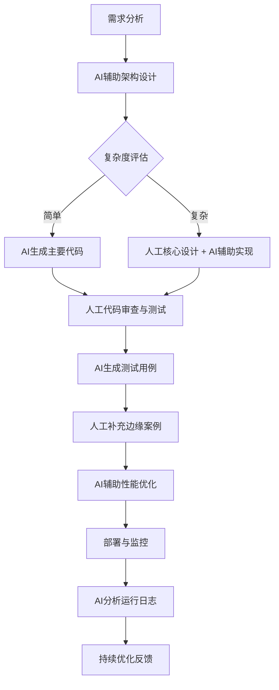

本文深度探讨AI辅助编程与智能体的技术演进、分布式系统架构的现代实现，分析三者如何共同塑造下一代软件开发范式，为开发者提供从理论到实践的全面指南。

# AI驱动的软件工程革命：从自动编程到分布式架构的融合演进

## 引言：技术融合的新时代

我们正站在软件工程演进的十字路口。一方面，以大型语言模型（LLM）为代表的AI技术正以前所未有的速度渗透到开发流程的各个环节，从代码补全到系统设计，甚至催生了“自动编程”的愿景。另一方面，分布式系统架构、高并发处理等经典软件工程挑战依然存在，并在云原生时代呈现出新的复杂性。与此同时，AI智能体（Agent）技术的崛起，正在模糊工具与协作者的边界，将AI从被动响应转变为主动执行。

这三条技术主线并非孤立发展，而是正在深度融合：AI需要分布式架构来规模化部署，分布式系统可以借助AI进行智能运维，而智能体则是连接AI能力与复杂业务逻辑的桥梁。本文将从三个维度深入剖析这一技术融合趋势：AI辅助编程的现状与未来、AI智能体的工程化挑战与解决方案，以及现代分布式系统的生产级实现模式。我们将看到，未来的优秀开发者不仅需要扎实的工程能力，更要成为AI的“战略引导者”。

## 第一部分：AI辅助编程——从Copilot到“自动编程”的理性之路

### 1.1 演进历程：工具、助手与潜在的主导者

AI在编程领域的应用经历了明显的演进阶段：

- **第一阶段：智能补全工具**（如早期IDE插件）
- **第二阶段：上下文感知助手**（如GitHub Copilot，基于当前文件提供建议）
- **第三阶段：系统级协作者**（如Claude Code、Cursor，能理解项目结构、参与架构讨论）
- **未来阶段：自动编程愿景**（AI根据需求描述直接生成完整可运行系统）

Redis创始人antirez在《Automatic programming》一文中提出了一个关键观点：真正的“自动编程”并非让AI完全取代人类，而是**将编程从“指令翻译”提升为“意图实现”**。传统编程中，开发者需要将业务逻辑转化为精确的语法结构；而在AI辅助下，开发者可以更多关注“要什么”，而非“怎么写”。

### 1.2 人类引导：AI编程中的不可替代角色

尽管AI能力突飞猛进，但人类的设计直觉和持续引导仍然至关重要。这主要体现在：

**1. 架构直觉与系统思维**
AI擅长局部优化和模式匹配，但在整体系统架构设计上仍缺乏真正的“理解”。人类开发者对复杂度、可维护性、扩展性的直觉判断，是AI目前难以替代的。

**2. 需求澄清与边界定义**
AI对模糊需求的解读往往会产生偏差。开发者需要具备将模糊业务需求转化为精确技术约束的能力，为AI划定清晰的创作边界。

**3. 代码审查与质量把关**
AI生成的代码可能存在隐藏的逻辑错误、安全漏洞或性能问题。人类开发者需要保持批判性思维，进行深度代码审查。

```go
// 示例：人类引导AI生成更健壮的代码
// 模糊提示（可能导致不安全的代码）
// "写一个用户登录函数"

// 精确引导（包含安全约束和业务逻辑）
// "写一个用户登录函数，要求：
// 1. 使用bcrypt验证密码哈希
// 2. 实现登录失败次数限制（5次/小时）
// 3. 生成JWT令牌，有效期24小时
// 4. 记录登录审计日志"

// AI生成的代码框架（经过人类引导后）
func UserLogin(username, password string) (*AuthToken, error) {
    // 1. 验证失败次数
    if exceeded := checkLoginAttempts(username); exceeded {
        return nil, ErrTooManyAttempts
    }
    
    // 2. 获取用户并验证密码
    user, err := getUserByUsername(username)
    if err != nil || !verifyPassword(user.PasswordHash, password) {
        recordFailedAttempt(username)  // 记录失败
        return nil, ErrInvalidCredentials
    }
    
    // 3. 生成JWT令牌
    token, err := generateJWT(user.ID, 24*time.Hour)
    if err != nil {
        return nil, err
    }
    
    // 4. 记录成功登录
    recordLoginAudit(user.ID, "success")
    resetLoginAttempts(username)
    
    return &AuthToken{Token: token, ExpiresAt: time.Now().Add(24*time.Hour)}, nil
}
```

### 1.3 理性态度：拥抱AI但不盲从

面对AI编程的热潮，antirez在另一篇文章《Don't fall into the anti-AI hype》中提醒开发者保持理性。他指出，当前存在两种极端：过度追捧AI能解决一切问题，或完全否定AI的实际价值。正确的态度应该是：

- **承认AI的局限性**：AI不是魔法，其能力受限于训练数据、上下文长度和推理能力
- **关注实际生产力提升**：衡量AI工具是否真正减少了重复劳动、加速了开发流程
- **保持核心技能**：基础算法、系统设计、调试能力等核心技能在AI时代更加重要

**实践建议**：将AI编程助手集成到工作流中，但建立明确的“检查点”。例如，在需求分析、架构设计、代码审查等关键阶段保持人类主导，而在实现细节、文档生成、测试用例编写等环节充分利用AI效率。

## 第二部分：AI智能体——从实验概念到企业级落地的技术挑战

### 2.1 技术演进：从简单提示到复杂系统

AI智能体的概念在过去两年经历了快速迭代。Tina Huang在《Building Agents in 2026》中预测了未来智能体的发展方向：

**当前主流架构**：
1. **工具调用型**：LLM + 函数调用（如OpenAI Function Calling）
2. **规划-执行型**：LLM制定计划，逐步执行（如ReAct模式）
3. **多智能体协作**：多个专用智能体分工合作

**未来趋势**：
- **模型即Agent**：专门为智能体任务训练的模型，而非通用LLM适配
- **长期记忆与学习**：智能体能够从历史交互中持续学习改进
- **自主目标分解**：将复杂目标自动分解为可执行步骤

### 2.2 企业级落地的四大挑战

《BestBlogs周刊第71期》总结了AI智能体在企业落地面临的核心挑战：

#### 挑战一：可控性与安全性
企业应用对错误容忍度极低。智能体的“幻觉”问题、不可预测的行为可能带来业务风险。

**解决方案**：
- **沙箱环境**：在受限环境中执行敏感操作
- **审批工作流**：关键操作需要人类确认
- **行为监控与审计**：记录智能体的所有决策和操作

#### 挑战二：成本与性能
频繁调用LLM API成本高昂，响应延迟影响用户体验。

**解决方案**：
- **分层模型策略**：简单任务使用小模型，复杂推理使用大模型
- **缓存与记忆**：缓存常见查询结果，减少重复计算
- **本地模型部署**：对延迟敏感的场景使用本地化部署

#### 挑战三：系统集成
如何让智能体与企业现有系统（CRM、ERP、数据库等）无缝集成。

**解决方案**：
```python
# 示例：企业智能体集成架构
class EnterpriseAgent:
    def __init__(self):
        self.llm = LLMClient()
        self.tools = {
            "query_database": DatabaseTool(),
            "call_api": APITool(),
            "generate_report": ReportTool(),
            "send_approval": ApprovalWorkflowTool()  # 与企业审批系统集成
        }
        
    async def handle_request(self, user_request: str, context: dict):
        # 1. 理解意图并规划
        plan = await self.llm.generate_plan(user_request, context)
        
        # 2. 安全检查
        if not self.security_check(plan):
            return "请求需要人工审批"
            
        # 3. 执行计划
        results = []
        for step in plan.steps:
            tool = self.tools.get(step.tool_name)
            if tool:
                result = await tool.execute(step.parameters)
                results.append(result)
                
                # 4. 监控与异常处理
                if self.is_abnormal_result(result):
                    await self.escalate_to_human(step, result)
                    break
        
        # 5. 汇总结果
        return await self.llm.summarize(results, user_request)
```

#### 挑战四：评估与优化
缺乏标准化的智能体性能评估体系。

**解决方案**：
- **建立测试套件**：针对常见任务场景创建测试用例
- **A/B测试**：对比智能体与人工或其他方案的性能
- **持续反馈循环**：收集用户反馈优化智能体行为

### 2.3 Claude Code的启示：专用化智能体的优势

Claude Code作为编程专用智能体，展示了领域专用化的价值：
- **深度理解代码上下文**：不仅仅是当前文件，而是整个项目结构
- **编程最佳实践内嵌**：生成的代码符合行业规范
- **调试与问题诊断**：能够理解错误信息并提供修复建议

这提示我们：未来的企业智能体可能不是“通用助手”，而是**一系列专用智能体的集合**——客服智能体、数据分析智能体、运维智能体等，各自针对特定场景优化。

## 第三部分：分布式系统架构——AI时代的工程基石

### 3.1 现代分布式聊天室：Go语言实现全景

《How to Build a Production-Grade Distributed Chatroom in Go》提供了一个极佳的生产级分布式系统案例。让我们深入分析其架构设计：

#### 核心架构组件
```go
// 简化的系统架构概览
type ChatSystem struct {
    // 1. 连接管理层
    connectionPool *ConnectionPool  // 管理WebSocket连接
    
    // 2. 消息总线（分布式核心）
    messageBus *MessageBus          // 基于Redis Pub/Sub或Kafka
    
    // 3. 会话管理
    sessionManager *SessionManager  // 分布式会话存储
    
    // 4. 数据持久化
    messageStore MessageStore       // 消息持久化到数据库
    
    // 5. 监控与健康检查
    metricsCollector *MetricsCollector
    healthChecker *HealthChecker
}
```

#### 高并发处理模式

**连接管理优化**：
```go
// 使用goroutine池处理连接，避免goroutine泄露
func (s *ChatSystem) handleConnection(conn *websocket.Conn) {
    // 将连接注册到连接池
    clientID := s.connectionPool.Register(conn)
    defer s.connectionPool.Unregister(clientID)
    
    // 使用带缓冲的channel进行消息收发
    sendChan := make(chan []byte, 100)
    receiveChan := make(chan []byte, 100)
    
    // 启动读写goroutine
    go s.readPump(conn, receiveChan)
    go s.writePump(conn, sendChan)
    
    // 主处理循环
    for {
        select {
        case msg := <-receiveChan:
            s.processMessage(clientID, msg)
        case <-time.After(30 * time.Second):
            // 心跳检测
            s.sendHeartbeat(clientID, sendChan)
        }
    }
}
```

#### 消息传递的可靠性保证

分布式聊天系统的核心挑战是消息的可靠传递和一致性。文章提出了多层保障机制：

1. **至少一次投递**：通过消息确认和重试机制
2. **消息去重**：使用唯一ID避免重复处理
3. **顺序保证**：在分区内保证消息顺序

### 3.2 容错与恢复策略

生产级系统必须能够优雅地处理故障：

**1. 连接故障恢复**
```go
func (c *Client) maintainConnection() {
    for {
        conn, err := c.connect()
        if err != nil {
            // 指数退避重连
            delay := c.calculateBackoff()
            time.Sleep(delay)
            continue
        }
        
        // 连接成功，开始处理
        if err := c.handle(conn); err != nil {
            // 处理错误，准备重连
            c.logger.Error("连接处理错误", "error", err)
        }
    }
}
```

**2. 数据一致性保障**
- **最终一致性模型**：适合聊天场景，允许短暂的不一致
- **操作日志（WAL）**：所有操作先记录日志，再执行
- **定期快照**：定期保存系统状态，加速恢复

**3. 监控与告警**
- **关键指标监控**：连接数、消息延迟、错误率等
- **分布式追踪**：跟踪消息在系统中的完整路径
- **自动扩缩容**：基于负载自动调整资源

### 3.3 AI与分布式系统的融合

AI技术正在改变分布式系统的设计和管理方式：

**1. 智能负载预测**
使用机器学习模型预测流量峰值，提前进行资源调配。

**2. 异常检测与自愈**
AI模型可以识别异常模式（如内存泄漏、网络分区），并自动触发修复流程。

**3. 配置优化**
AI可以分析系统运行数据，自动优化配置参数（如线程池大小、缓存策略）。

## 第四部分：融合实践——构建AI增强的分布式系统

### 4.1 架构模式：AI作为一等公民

在现代系统中，AI不应是事后添加的插件，而应是架构设计时的一等公民。以下是几种融合模式：

**模式一：AI增强的消息路由**
```go
// 智能消息路由器
type SmartMessageRouter struct {
    llmClient    *LLMClient      // AI服务客户端
    rulesEngine  *RulesEngine    // 传统规则引擎
    
    // 路由决策：结合AI理解和业务规则
    func RouteMessage(msg Message) ([]string, error) {
        // 1. AI理解消息意图和优先级
        analysis, err := llmClient.AnalyzeMessage(msg)
        if err != nil {
            // 降级：使用规则引擎
            return rulesEngine.Route(msg)
        }
        
        // 2. 结合业务规则做最终决策
        destinations := rulesEngine.ValidateRoutes(analysis.SuggestedRoutes)
        
        // 3. 考虑系统负载和用户偏好
        optimized := optimizeForLoad(destinations, currentLoad())
        
        return optimized, nil
    }
}
```

**模式二：智能会话管理**
在分布式聊天系统中，AI可以：
- **实时内容审核**：检测不当言论并自动处理
- **个性化体验**：基于用户历史提供定制化功能
- **智能客服**：自动回答常见问题，复杂问题转人工

### 4.2 开发工作流重构

AI时代需要重新思考开发工作流。以下是建议的新流程：



### 4.3 团队技能转型

面对技术融合，开发团队需要新的技能组合：

**核心技能矩阵**：

| 传统技能 | 新增AI相关技能 | 融合技能 |
|---------|---------------|----------|
| 算法与数据结构 | 提示工程与优化 | AI辅助算法设计 |
| 系统架构设计 | AI系统集成模式 | AI原生架构设计 |
| 代码调试 | AI代码审查辅助 | 智能调试与根因分析 |
| 性能优化 | AI模型推理优化 | 端到端系统性能调优 |
| 团队协作 | AI工作流设计 | 人-AI协作流程管理 |

## 第五部分：未来展望与行动指南

### 5.1 技术趋势预测

基于当前发展，我们可以预见以下趋势：

**短期（1-2年）**：
- AI编程助手成为标准开发环境的一部分
- 专用领域智能体在企业中初步落地
- 更多AI增强的分布式系统组件出现

**中期（3-5年）**：
- “AI优先”的编程语言和框架出现
- 智能体间标准化通信协议形成
- 分布式系统具备更强的自管理能力

**长期（5年以上）**：
- 人-AI协作成为主流开发模式
- 软件系统具备持续自我演进能力
- 编程从“写代码”转向“训练和引导AI”

### 5.2 给开发者的行动建议

1. **拥抱变化但保持根本**：深入学习AI技术，但不要忽视计算机科学基础

2. **实践人-AI协作**：在自己的项目中尝试AI工具，找到最佳协作模式

3. **关注可解释性**：无论是AI决策还是分布式系统行为，都要确保可理解和可调试

4. **建立评估体系**：为AI生成的代码和智能体的行为建立质量评估标准

5. **参与社区贡献**：开源项目是学习这些融合技术的最佳途径

### 5.3 伦理与责任考量

随着AI在软件工程中的深入，我们必须考虑：

- **透明度**：用户应知道何时在与AI交互
- **责任归属**：AI生成代码导致的问题责任如何划分
- **技能公平**：确保AI工具不会加剧技术鸿沟
- **环境影响**：大规模AI计算和分布式系统的能源消耗

## 结语：成为AI时代的架构师

我们正在见证软件工程的根本性转变。AI辅助编程、智能体技术和分布式系统架构的融合，不是简单的技术叠加，而是产生了新的范式。未来的软件系统将是**人类智能、人工智能和分布式计算**的有机结合体。

在这种新范式中，开发者的角色将从“代码编写者”演变为“系统引导者”和“AI训练师”。我们需要同时掌握三种语言：与人类沟通的业务语言、与AI协作的提示语言、与机器交互的编程语言。

正如antirez所提醒的，我们不应陷入对AI的过度炒作或完全否定，而应保持理性务实的态度。AI是强大的工具，但工具的价值最终取决于使用者的智慧和判断。分布式系统架构等传统工程技能，在AI时代不仅没有过时，反而因为系统复杂度的增加而更加重要。

最终，技术发展的目标不是用AI取代人类，而是**增强人类的能力**，让我们能够构建更强大、更智能、更可靠的系统来解决现实世界的复杂问题。这场融合之旅刚刚开始，而我们已经站在了起点上。

---

**延伸阅读**：
1. [Automatic programming - antirez](http://antirez.com/news/159)
2. [Don't fall into the anti-AI hype - antirez](http://antirez.com/news/158)
3. [📋 BestBlogs 周刊第71期：AI智能体的技术进展与落地挑战](https://ginonotes.com/posts/bestblogs-weekly-issue-71)
4. [Building Agents in 2026 (major updates!) - Tina Huang](https://www.youtube.com/watch?v=D-d4Y6v-pDs)
5. [How to Build a Production-Grade Distributed Chatroom in Go - freeCodeCamp](https://www.freecodecamp.org/news/how-to-build-a-production-grade-distributed-chatroom-in-go-full-handbook/)

---
