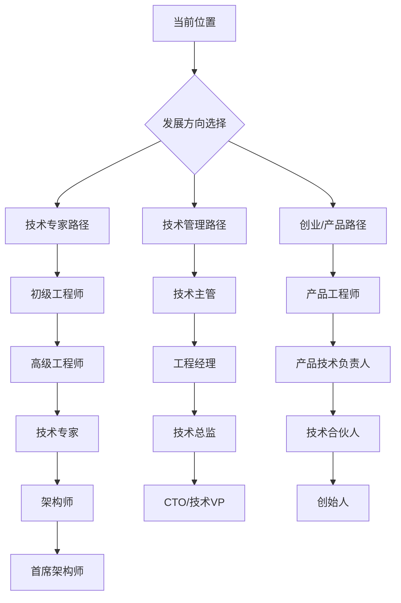

# 2026年技术人的系统工程与自我设计

## 引言：技术演进的十字路口

回顾过去几年的技术发展，一个清晰的脉络正在浮现：我们正从追求“从0到1”的功能创新，大步迈向“从1到N”的系统工程与可持续性发展阶段。无论是AI模型从实验室走向每秒处理数万请求的生产环境，还是支撑亿万用户的基础设施需要在不被察觉的情况下稳定运行，亦或是技术从业者从被动执行到主动规划自己的成长路径——**系统性、可靠性、可持续性**已成为这个时代技术演进的核心关键词。

正如dbaplus社群在《2026，骐骥驰骋，码力全开！》中所展望的，未来的技术竞争不仅是功能的竞争，更是系统稳定性、团队协作效率和人才持续成长的综合竞争。本期我们将从三个看似独立实则紧密相连的维度——高并发模型服务、中间件运维反思、技术人职业规划——来剖析这一趋势，并为身处其中的技术人提供一套完整的思考框架和实践指南。

## 第一部分：高并发模型服务——当AI遇见工程极限

### 1.1 高QPS模型服务的挑战与机遇

随着ChatGPT等生成式AI应用的爆发，企业对于实时AI推理的需求呈指数级增长。一个推荐系统可能需要每秒处理数万次用户请求，一个欺诈检测模型需要在毫秒级内做出判断，一个智能客服系统需要同时服务成千上万的对话。**高QPS（每秒查询率）模型服务**已从少数科技巨头的专利，变成了众多企业的标配需求。

然而，将训练好的模型部署到高并发生产环境中，远比在Jupyter Notebook中运行推理复杂得多。主要挑战包括：

- **延迟与吞吐的权衡**：低延迟（快速响应单个请求）和高吞吐（处理大量并发请求）往往相互制约
- **资源利用效率**：GPU等昂贵计算资源如何在请求波峰波谷间保持高效利用
- **成本控制**：如何在保证SLA（服务等级协议）的前提下，最小化基础设施成本
- **模型更新与版本管理**：如何在不停服的情况下安全地更新模型版本

### 1.2 Databricks的高QPS模型服务最佳实践

Databricks在《Best Practices for High QPS Model Serving on Databricks》一文中，分享了他们在实际客户场景中积累的宝贵经验。这些实践不仅适用于Databricks平台，其背后的设计思想具有普适性。

#### **架构设计：异步与批处理的精妙平衡**

传统同步请求-响应模式在高QPS场景下会导致资源闲置和延迟增加。Databricks建议采用**异步推理**与**动态批处理**相结合的策略。

```python
# 简化的动态批处理示例
from concurrent.futures import ThreadPoolExecutor
import time
from collections import deque

class DynamicBatchProcessor:
    def __init__(self, model, max_batch_size=32, max_wait_time=0.01):
        self.model = model
        self.max_batch_size = max_batch_size
        self.max_wait_time = max_wait_time  # 最大等待时间（秒）
        self.request_queue = deque()
        self.executor = ThreadPoolExecutor(max_workers=4)
        
    def process_request(self, input_data):
        """处理单个请求，实际实现中会加入队列等待批处理"""
        future = self.executor.submit(self._batch_process, input_data)
        return future
    
    def _batch_process(self, *inputs):
        """动态收集请求进行批处理"""
        batch = []
        futures = []
        
        # 收集请求直到达到最大批大小或等待超时
        start_time = time.time()
        while len(batch) < self.max_batch_size:
            if self.request_queue:
                input_data, future = self.request_queue.popleft()
                batch.append(input_data)
                futures.append(future)
            
            if time.time() - start_time > self.max_wait_time:
                break
            
            if not self.request_queue and len(batch) > 0:
                break
                
            time.sleep(0.001)  # 短暂休眠避免CPU空转
        
        if batch:
            # 执行批量推理
            batch_results = self.model.predict(batch)
            
            # 将结果设置到各个future
            for i, future in enumerate(futures):
                future.set_result(batch_results[i])
        
        return len(batch)
```

**关键洞察**：动态批处理的核心是在延迟和吞吐之间找到最佳平衡点。通过调整`max_wait_time`和`max_batch_size`，可以根据不同的SLA要求优化系统行为。

#### **资源优化：自动扩缩容与智能调度**

高QPS服务的负载往往具有明显的周期性特征（如电商促销、内容高峰时段）。Databricks建议：

1. **基于预测的自动扩缩容**：利用历史负载数据训练时间序列预测模型，提前预判资源需求
2. **混合精度推理**：在精度损失可接受的场景下，使用FP16甚至INT8精度，可大幅提升吞吐并降低成本
3. **模型分片与流水线并行**：将大模型拆分成多个阶段，在不同实例上并行执行

#### **监控与可观测性**

没有监控的高并发服务如同盲人骑马。必须建立多维度的监控体系：

- **性能指标**：P99/P95延迟、QPS、错误率、GPU利用率
- **业务指标**：推理准确率、业务转化率（将技术指标与业务价值关联）
- **成本指标**：每次推理的成本、资源利用率

### 1.3 实践建议：构建高并发模型服务的检查清单

1. **负载测试先行**：在生产部署前，使用真实流量模式进行压力测试
2. **实现优雅降级**：在系统过载时，优先保证核心功能的可用性
3. **建立A/B测试框架**：确保新模型版本不会导致性能回退
4. **考虑多区域部署**：为全球用户提供低延迟服务，同时提高系统容灾能力

## 第二部分：中间件运维的极端案例——当自动化达到极致

### 2.1 一个令人震惊的案例：消失的中间件团队

dbaplus社群在《离奇！中间件团队消失半年了，居然没人发现……》一文中，讲述了一个看似荒诞却发人深省的真实案例：某大型互联网公司的中间件团队，在团队人员实际上已半年没有正常工作的情况下，公司的各项业务居然照常运行，直到一次偶然的审计才被发现。

这个案例表面上看是个管理笑话，但深入分析，它揭示了现代分布式系统运维的几个深刻真相：

1. **高度自动化的系统确实可以长时间自治运行**
2. **当监控和告警过于“智能”，可能会掩盖根本性问题**
3. **团队的价值不应仅体现在“救火”次数上**

### 2.2 系统稳定性的四个层次

从这个极端案例出发，我们可以将系统稳定性分为四个演进层次：

#### **第一层：人工运维（手工操作）**
- 特点：所有操作都需要人工介入，响应慢，容易出错
- 指标：MTTR（平均恢复时间）以小时或天计
- 风险：高度依赖个人经验，人员变动风险大

#### **第二层：基础自动化（脚本化）**
- 特点：常见操作已脚本化，但决策仍需人工
- 指标：MTTR降至分钟级
- 风险：脚本维护成本高，异常场景覆盖不全

#### **第三层：智能自动化（基于规则的自动化）**
- 特点：系统能自动检测并修复已知问题
- 指标：MTTR降至秒级，部分场景实现“零停机”
- 风险：规则可能过时，复杂故障难以处理

#### **第四层：自治系统（AI驱动的自愈）**
- 特点：系统能学习、预测并预防问题
- 指标：故障预防率>90%，真正实现“无人值守”
- 挑战：需要大量高质量数据，解释性差

**消失的中间件团队案例**实际上展示了从第三层向第四层过渡时的尴尬：系统足够“智能”到掩盖了团队问题，但还不够“智慧”到识别这种组织层面的异常。

### 2.3 构建真正可靠系统的关键原则

#### **原则一：可观测性 > 监控**

监控告诉你系统“是什么状态”，而可观测性让你理解“为什么是这个状态”。一个健壮的可观测性体系应该包括：

- **指标（Metrics）**：系统状态的量化测量
- **日志（Logs）**：离散事件记录
- **追踪（Traces）**：请求在分布式系统中的完整路径
- **依赖关系图**：服务间的调用关系拓扑

```yaml
# 现代可观测性配置示例（OpenTelemetry）
receivers:
  otlp:
    protocols:
      grpc:
        endpoint: 0.0.0.0:4317
      http:
        endpoint: 0.0.0.0:4318

exporters:
  prometheus:
    endpoint: "0.0.0.0:8889"
  jaeger:
    endpoint: "jaeger:14250"
    insecure: true
  loki:
    endpoint: "http://loki:3100/loki/api/v1/push"

service:
  pipelines:
    traces:
      receivers: [otlp]
      exporters: [jaeger]
    metrics:
      receivers: [otlp]
      exporters: [prometheus]
    logs:
      receivers: [otlp]
      exporters: [loki]
```

#### **原则二：混沌工程不是可选项**

Netflix开创的混沌工程理念，主张主动注入故障来验证系统的韧性。定期进行混沌实验可以：

1. 发现单点故障和脆弱依赖
2. 验证故障转移和恢复机制
3. 训练团队应急响应能力
4. 防止“失效掩蔽”（一个组件失效被另一个掩盖）

#### **原则三：建立“健康度”的综合评估体系**

系统的健康度不应仅看技术指标，还应包括：

- **团队健康度**：人员流动率、知识文档完整性、值班负担
- **流程健康度**：变更成功率、事故复盘质量、技术债管理
- **业务健康度**：功能使用趋势、用户满意度、业务连续性

### 2.4 实践建议：避免成为“消失的团队”

1. **定期进行“假如我们团队消失”的演练**：识别系统对团队的真正依赖点
2. **建立跨团队知识共享机制**：避免知识孤岛
3. **将运维经验产品化**：把重复的解决方案变成自助服务平台
4. **保持适度的“可见度”**：定期向上下游团队展示工作价值

## 第三部分：技术人的职业规划——从被动执行到主动设计

### 3.1 谁在设计你的职业生涯？

Gino Notes在《谁在设计你的职业生涯？》一文中提出了一个尖锐的问题：大多数技术人的职业生涯是被动形成的——由项目需求、老板安排、市场趋势所推动，而非主动设计的结果。这种被动模式导致：

- **技能碎片化**：学了很多技术，但缺乏深度和系统性
- **职业天花板提前到来**：35岁危机本质上是规划缺失的危机
- **工作倦怠感强**：感觉自己在为别人的目标工作

### 3.2 职业生涯设计的系统框架

#### **第一步：定义你的职业坐标系**

建立一个三维的职业坐标系：

1. **技术深度轴**：从应用开发到架构设计，再到基础研究
2. **业务影响轴**：从执行任务到负责模块，再到驱动业务
3. **领导力轴**：从个人贡献者到团队领导，再到组织影响者



#### **第二步：实施“T型”技能发展策略**

- **横向广度**：了解相邻领域（如后端开发了解一些前端和运维）
- **纵向深度**：在1-2个核心领域达到专家水平
- **动态调整**：每2-3年评估一次技能组合的市场相关性

#### **第三步：建立个人技术品牌**

在开源社区、技术博客、行业会议等平台持续输出：

1. **解决实际问题的技术方案**
2. **深度的技术分析文章**
3. **开源项目贡献**
4. **行业洞察和趋势分析**

### 3.3 将职业规划与技术进步相结合

#### **结合点一：选择有长期价值的技术方向**

评估技术方向的几个维度：

- **市场需求持久性**：是短期热点还是长期趋势？
- **技术深度和壁垒**：是否有足够的学习深度？
- **生态健康度**：社区活跃度、就业机会如何？
- **与个人兴趣的匹配度**：是否真正感兴趣？

#### **结合点二：在项目中寻找成长机会**

不要只把项目当作任务，而是视为：

- **技术实验场**：尝试新技术、新架构
- **能力证明**：用项目成果展示你的能力
- **人脉拓展平台**：与优秀同事和合作伙伴建立联系
- **行业认知窗口**：深入理解业务和用户

#### **结合点三：建立个人学习系统**

```python
# 个人学习追踪系统概念设计
class LearningSystem:
    def __init__(self):
        self.skill_map = {}  # 技能图谱
        self.project_log = []  # 项目记录
        self.learning_plan = {}  # 学习计划
    
    def assess_skill_gap(self, target_role):
        """评估与目标角色的技能差距"""
        required_skills = self._get_role_requirements(target_role)
        current_skills = self._get_current_skills()
        
        gaps = {}
        for skill, level in required_skills.items():
            if skill not in current_skills or current_skills[skill] < level:
                gaps[skill] = level - current_skills.get(skill, 0)
        
        return gaps
    
    def create_learning_path(self, target_role, timeframe_months=12):
        """创建学习路径"""
        gaps = self.assess_skill_gap(target_role)
        
        # 优先级排序：基础技能优先，高价值技能优先
        prioritized_gaps = self._prioritize_gaps(gaps)
        
        # 制定季度学习计划
        quarterly_plans = {}
        for quarter in range(1, (timeframe_months // 3) + 1):
            quarterly_plans[f"Q{quarter}"] = self._select_skills_for_quarter(
                prioritized_gaps, quarter
            )
        
        return quarterly_plans
    
    def track_progress(self, project_experience):
        """通过项目经验追踪成长"""
        for skill_used in project_experience.skills_used:
            if skill_used in self.skill_map:
                self.skill_map[skill_used] += project_experience.complexity * 0.1
        
        self.project_log.append(project_experience)
```

### 3.4 实践建议：技术人的职业规划检查清单

1. **每年进行一次职业规划回顾**：评估进展，调整方向
2. **建立个人技术雷达**：追踪感兴趣的技术趋势
3. **寻找导师和同行者**：技术成长不是孤独的旅程
4. **平衡深度工作和广度学习**：70%时间深耕核心领域，30%时间探索新方向
5. **记录技术决策和思考过程**：建立个人知识库

## 第四部分：三位一体的实践指南

### 4.1 将高并发服务、系统稳定性和职业发展相结合

这三个主题看似独立，实则构成了现代技术人能力模型的三个支柱：

- **高并发模型服务**代表**技术深度**——解决复杂技术问题的能力
- **系统稳定性运维**代表**工程思维**——构建可靠、可维护系统的能力
- **职业规划**代表**自我管理**——持续成长和创造价值的能力

### 4.2 构建个人技术栈的演进策略

#### **初级阶段（0-3年）：夯实基础，建立信心**
- 重点：掌握1-2门核心技术栈，理解基础架构原理
- 项目选择：参与有明确需求的中小型项目
- 学习方式：系统课程学习 + 实践练习

#### **中级阶段（3-8年）：拓展边界，建立专长**
- 重点：在特定领域建立深度，开始关注系统设计
- 项目选择：主导模块设计，解决复杂技术问题
- 学习方式：深度实践 + 技术社区参与

#### **高级阶段（8年以上）：创造影响，引领方向**
- 重点：技术战略思考，跨团队协作，人才培养
- 项目选择：驱动技术架构演进，解决业务关键问题
- 学习方式：行业洞察 + 经验提炼 +  mentorship

### 4.3 组织层面的支持体系

技术人的成长不仅是个人的责任，也需要组织的支持：

1. **建立清晰的技术职级体系**：明确各层级的能力要求
2. **提供持续学习资源**：培训预算、学习时间、技术大会参与机会
3. **鼓励技术分享和文化建设**：内部分享会、技术博客奖励、开源贡献认可
4. **实施合理的轮岗机制**：让技术人员接触不同业务和技术栈

## 总结与展望：技术人的2026与未来

站在2026年的技术十字路口，我们看到了几个明确的趋势：

### **趋势一：AI工程化成为核心竞争力**

AI模型的服务化、产品化能力，正成为企业差异化竞争的关键。未来几年，我们将会看到：

- **模型服务基础设施的标准化**：类似Kubernetes之于容器，将出现AI服务编排的标准
- **边缘AI推理的普及**：在终端设备上进行实时推理，减少云端依赖
- **AI原生应用架构的成熟**：从“AI赋能”到“AI原生”的架构演进

### **趋势二：系统自治程度不断提高**

从“消失的中间件团队”案例中，我们窥见了未来系统的样貌：

- **AIOps的全面应用**：AI不仅用于业务，也用于运维自身
- **故障预测和自愈成为标配**：从“快速恢复”到“避免故障”的转变
- **人机协作的新模式**：人类专注于战略和创新，机器负责执行和运维

### **趋势三：技术人职业路径多元化**

技术人的职业发展正在打破单一线性路径：

- **专家路径的重新认可**：资深技术专家获得与管理层相当的影响力和回报
- **技术创业门槛降低**：云原生和AI技术让个人或小团队也能创造有价值的产品
- **跨界融合成为常态**：技术+业务、技术+设计、技术+管理等复合型人才更受欢迎

### **给技术人的最后建议**

1. **保持技术好奇心，但要有选择地深入**：在信息过载的时代，深度比广度更有价值
2. **将每个项目视为个人品牌的建设机会**：你的代码、设计和文档都在为你代言
3. **建立自己的思考框架**：不要只做技术的使用者，更要做技术的思考者和创造者
4. **关注技术的社会影响**：技术最终要服务于人，理解技术背后的伦理和责任

正如《2026，骐骥驰骋，码力全开！》中所展望的，未来属于那些既能深入技术细节，又能把握系统全局，同时能持续自我进化的技术人。在这个快速变化的时代，唯一不变的是变化本身，而最好的应对策略就是：**主动设计你的技术，你的系统，以及你的职业生涯**。

---

**延伸阅读**：
1. [Best Practices for High QPS Model Serving on Databricks](https://www.databricks.com/blog/best-practices-high-qps-model-serving-databricks)
2. [离奇！中间件团队消失半年了，居然没人发现……](https://mp.weixin.qq.com/s?__biz=MzkzMjYzNjkzNw==&mid=2247634617&idx=1&sn=f62be91184ad6e480cd2ea04acff33f2)
3. [谁在设计你的职业生涯？](https://ginonotes.com/posts/if-you-dont-design-your-career-someone-else-will)
4. [2026，骐骥驰骋，码力全开！](https://mp.weixin.qq.com/s?__biz=MzkzMjYzNjkzNw==&mid=2247634618&idx=1&sn=dd60e74e6c9e8d55f8aace999584fbd7)

---
